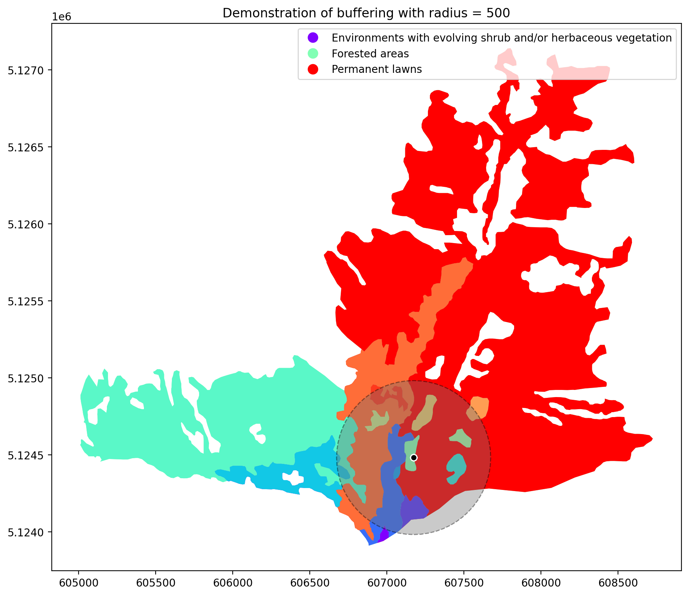

# GEO-AI Challenge for Landslide Susceptibility Mapping 3rd place solution

This repository contains the code used for my submission for Zindi's [GEO-AI Challenge for Landslide Susceptibility Mapping by ITU](https://zindi.africa/competitions/geo-ai-challenge-for-landslide-susceptibility-mapping/) competition. The goal of the challenge was to develop an accurate and cost-effective model for landslide susceptibility mapping in the Valtellina Valley region in Italy using machine learning techniques.

My submission for the competition used the only the official [datasets provided by the competition hosts](https://zindi.africa/competitions/geo-ai-challenge-for-landslide-susceptibility-mapping/data) in order to obtain the features used for the model. In order to engineer features I created a circular buffer zone for each data point with the following radii: 100 m, 500 m, 1 km, 2.5 km, gathering information and relevant characteristics present in these areas. This is done because given that we want to model landslide susceptibility, the information present directly within the geometry that we're considering might not be enough. For instance, the fact that there's a river 50 m away from the geometry we're analyzing might make it more susceptible to a landslide, even though the river isn't crossing directly thorough the geometry. The following image demonstrates buffering:

After acquiring and engineering the features, I used a LightGBM model to fit the data, performing a hyperparameter search with Optuna with 5-fold cross-validation to achieve the best performance. After 100 optimization trials, the model achieved an accuracy of 96.82% on the 5-fold cross-validation, leading to a score of 94.67% on the final competition leaderboard, achieving **3rd place**! 

This repository is structured as follows:
- `main.ipynb`: Jupyter notebook file containing my complete analysis, thoroughly explained. It can be better visualized in the following [nbviewer link](https://nbviewer.org/github/zysymu/GEO-AI-Challenge-for-Landslide-Susceptibility-Mapping/blob/main/main.ipynb).
- `GEO-AI Challenge for Landslide Susceptibility Mapping report.pdf.pdf`: an executive summary explaining the development of my features and model.
- `predictions.csv`: final predictions used for the competition.
- `buffer_demonstration.png`: image to demonstrate buffering.
